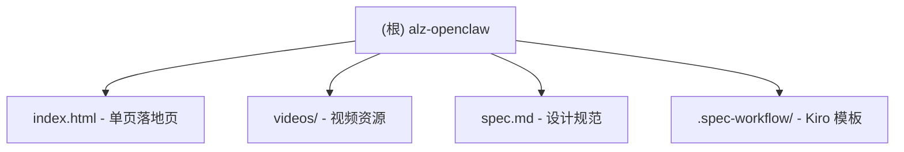

# CLAUDE.md

This file provides guidance to Claude Code (claude.ai/code) when working with code in this repository.

## 项目愿景

ALZ OpenClaw 是一个产品落地页，用于推广 ALZ 的 OpenClaw Fast Track 服务 -- 一个面向开发者的托管式 AI 编程工具方案。核心卖点：无需自建环境，28 元/周起步即可使用独立 VPS 上的 OpenClaw。

## 架构总览

这是一个纯静态单页项目，没有构建系统、没有包管理器、没有框架依赖。

## 技术栈

- 单个 HTML 文件，内嵌 CSS + Vanilla JS
- 外部依赖仅 Google Fonts (Inter)
- 无构建工具、无包管理器、无框架
- 中文内容 (zh-CN)

## 项目结构

| 路径 | 说明 |
|------|------|
| `index.html` | 完整落地页（HTML + CSS + JS 全内嵌） |
| `spec.md` | 页面设计规范（配色、排版、分区结构） |
| `videos/` | Hero 区域背景视频（hero_bg.mp4, hero_loop.mp4） |
| `.spec-workflow/` | Kiro Spec Workflow 模板文件 |

## 页面分区

1. Hero -- 全屏视频背景 + 主标题 + CTA
2. Features -- 5 个核心卖点卡片（5 分钟上手、独立 VPS、不绑模型、版本常新、低门槛）
3. Pricing -- 三档定价卡片（体验版 28 元/周、实用版 58 元/周、长租版 98 元/首月）
4. Comparison -- 与 Docker 多用户/阿里腾讯一键/Mac Mini 本地方案的对比表
5. Contact -- 微信联系方式（alz-ai）
6. Footer

## 设计规范

- 深色主题：主背景 #0D0D0D，卡片 #141414
- 强调色：翠绿 #00FF88（主）、橙色 #FF6B35（价格）
- 禁止使用蓝色/紫色
- 响应式设计，768px 断点切换移动端布局
- 滚动淡入动画（IntersectionObserver）

## 开发与运行

直接用浏览器打开 `index.html` 即可预览，无需任何构建步骤。

## 注意事项

- `index.html` 尾部包含一段 iframe 高亮注入脚本（用于外部工具的元素选择功能），修改页面时注意不要破坏该脚本
- `*.Zone.Identifier` 文件是 Windows/WSL 下载标记文件，可忽略
- 视频文件为二进制资源，不要尝试读取内容

## 编码规范

- CSS 使用 CSS 自定义属性（var(--xxx)）管理主题色
- JS 保持原生，不引入外部库
- 保持单文件结构，所有样式和脚本内嵌在 HTML 中

## AI 使用指引

- 修改样式时参考 `:root` 中的 CSS 变量定义
- 新增分区时遵循现有的 section > container > section-header + content 结构
- 卡片组件遵循 fade-in 动画类名约定
- 定价信息修改需同步更新 Hero 区域的价格文案

## 变更记录 (Changelog)

- 2026-02-14: 初始化 CLAUDE.md，完成项目架构分析
