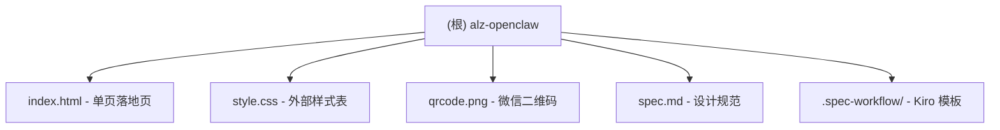

# CLAUDE.md

This file provides guidance to Claude Code (claude.ai/code) when working with code in this repository.

## 项目愿景

ALZ AI 咨询服务网站，用于推广阿兹的专业 AI 咨询与部署服务。核心定位：15 年工程经验 + 稳定 AI 模型渠道 + 实战导向的技术咨询服务。目标客户为个人开发者和小微企业。

## 架构总览

这是一个纯静态单页项目，没有构建系统、没有包管理器、没有框架依赖。

```mermaid
graph TD
    A["(根) alz-openclaw"] --> B["index.html - 单页落地页"]
    A --> C["style.css - 外部样式表"]
    A --> D["qrcode.png - 微信二维码"]
    A --> E["spec.md - 设计规范"]
    A --> F[".spec-workflow/ - Kiro 模板"]
```

## 技术栈

- HTML + 外部 CSS (style.css) + Vanilla JS
- 外部依赖仅 Google Fonts (Inter)
- 无构建工具、无包管理器、无框架
- 中文内容 (zh-CN)

## 项目结构

| 路径 | 说明 |
|------|------|
| `index.html` | 完整落地页（HTML + JS） |
| `style.css` | 外部样式表（商务风格配色） |
| `qrcode.png` | 微信二维码图片 |
| `spec.md` | 页面设计规范（配色、排版、分区结构） |
| `videos/` | （已废弃）原 Hero 区域背景视频 |
| `.spec-workflow/` | Kiro Spec Workflow 模板文件 |

## 页面分区

1. **Hero** -- 静态渐变背景 + 主标题 + CTA
2. **About** -- 个人背景介绍 + 关键数据 + 技术资源优势
3. **Services** -- 4 个服务类型（AI 工具部署、架构咨询、定制开发、技术培训）
4. **Advantages** -- 5 个核心优势（实战经验、前沿敏感、资源优势、公益背书、透明定价）
5. **Pricing** -- 3 种计费模式（免费咨询、项目报价、按时计费）
6. **Process** -- 5 步服务流程（预约咨询 → 方案设计 → 报价确认 → 项目实施 → 交付验收）
7. **Contact** -- 微信联系方式（alz-ai）+ 二维码
8. **Footer** -- 品牌 + 博客链接 (https://blog.alz-ai.cn)

## 设计规范（商务风格）

- 深色主题：主背景 #0f0f0f，卡片 #1a1a1a
- 强调色：翠绿 #10b981（主）、蓝色 #3b82f6（价格）、金色 #fbbf24（特殊标记）
- Hero 背景：径向渐变 + 网格纹理（静态，无视频）
- 响应式设计，768px 断点切换移动端布局
- 滚动淡入动画（IntersectionObserver）
- 卡片阴影和悬停效果，提升商务质感

## 开发与运行

直接用浏览器打开 `index.html` 即可预览，无需任何构建步骤。

## 注意事项

- `index.html` 尾部包含一段 iframe 高亮注入脚本（用于外部工具的元素选择功能），修改页面时注意不要破坏该脚本
- `*.Zone.Identifier` 文件是 Windows/WSL 下载标记文件，可忽略
- 原 `videos/` 目录已废弃，Hero 区改用静态渐变背景

## 编码规范

- CSS 使用 CSS 自定义属性（var(--xxx)）管理主题色
- JS 保持原生，不引入外部库
- HTML 和 CSS 分离，样式统一在 style.css 中管理
- 保持语义化 HTML 结构

## AI 使用指引

- 修改样式时参考 `style.css` 中的 CSS 变量定义
- 新增分区时遵循现有的 section > container > section-header + content 结构
- 卡片组件遵循 fade-in 动画类名约定
- 定价信息修改需同步更新 Hero 区域的价格文案

## 变更记录 (Changelog)

- 2026-03-11: 完成网站重构，从 OpenClaw 租用服务转型为 AI 咨询服务
  - 更新所有页面内容和文案
  - 采用商务风格配色（翠绿 + 蓝色 + 金色）
  - Hero 区改用静态渐变背景（移除视频）
  - 新增 About、Advantages、Process 分区
  - 重构 Services 和 Pricing 分区
  - 添加博客链接到 Footer
- 2026-02-14: 初始化 CLAUDE.md，完成项目架构分析
